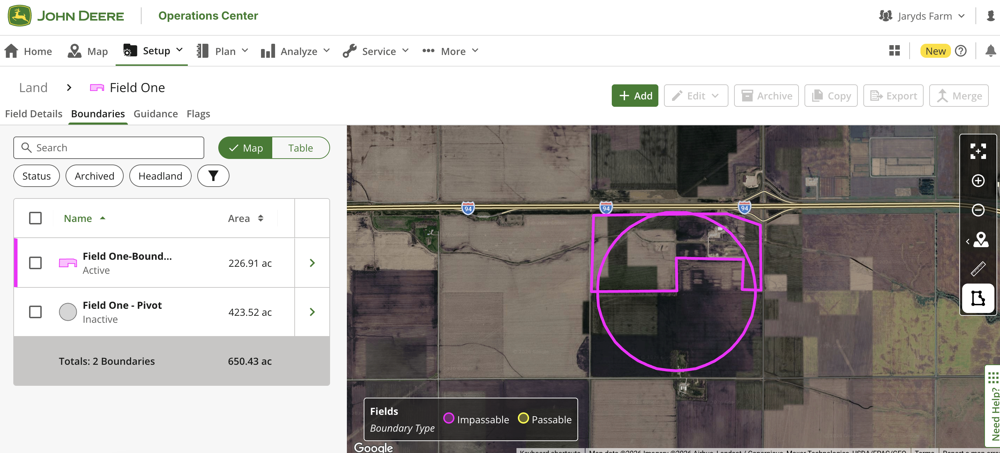
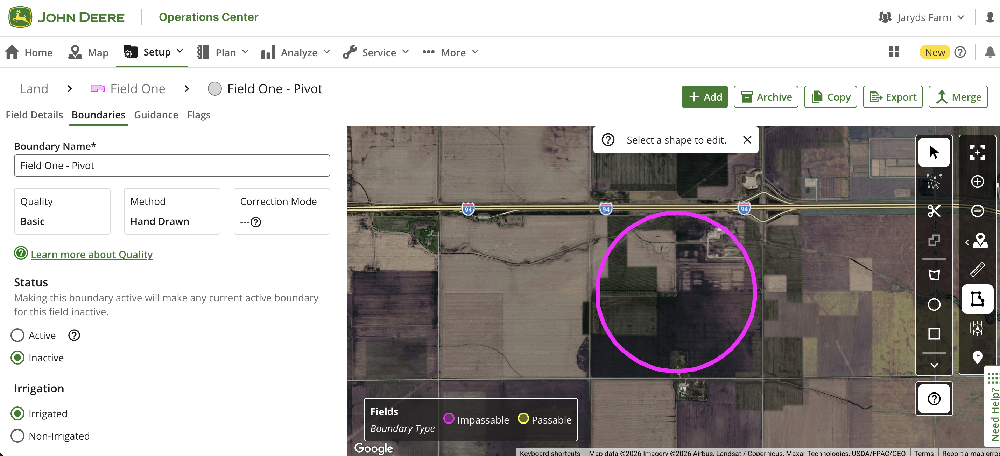

# Farm Data Hub

A demo web app that connects to the **John Deere Operations Center API** to display farm data — fields, boundaries, irrigation analysis, and harvest/seeding operations — all behind a Supabase-powered auth layer.


---

## What it does

1. Users sign in or create an account (Supabase Auth).
2. They connect their John Deere Operations Center account via OAuth 2.0.
3. They pick an organization and browse **fields**, **boundaries**, and **operations** (harvest, seeding) pulled from the John Deere API.
4. Fields are displayed on a Mapbox GL satellite map with active and irrigated boundary overlays.
5. Irrigation analysis classifies harvest/seeding data into irrigated vs. dryland zones using shapefile-based polygon classification.

## Tech stack

| Layer | Technology |
|-------|-----------|
| Frontend | Next.js 13 (App Router), React, Tailwind CSS, shadcn/ui, Mapbox GL |
| Backend | Supabase Edge Functions (Deno) |
| Database | Supabase (PostgreSQL) |
| Auth | Supabase Auth (email/password) + John Deere OAuth 2.0 |
| Hosting | Bolt (current) · Netlify (ready via `netlify.toml`) |

## Project structure

```
app/
  page.tsx                        # Root redirect (→ /login or /map)
  login/page.tsx                  # Sign-in / sign-up form
  dashboard/page.tsx              # Legacy dashboard (auth-gated)
  auth/callback/page.tsx          # John Deere OAuth callback handler
  (app)/
    map/page.tsx                  # Map-first main view
    map/field/[fieldId]/page.tsx  # Field detail view on map
    fields/page.tsx               # Fields grid list with filters
    operations/page.tsx           # Operations list with irrigation analysis
    settings/page.tsx             # User settings (area unit preference)

components/
  dashboard/                      # Dashboard feature components
    harvest-operations.tsx        # Harvest operations display
    planting-operations.tsx       # Planting operations display
    irrigation-analysis.tsx       # Irrigation analysis with shapefile processing
    area-unit-toggle.tsx          # Toggle between acres and hectares
    field-filters.tsx             # Client/farm filter controls
  map/                            # Map components
    full-map.tsx                  # Mapbox GL map with field + irrigated boundaries
    field-side-panel.tsx          # Field detail slide-in panel
    map-controls.tsx              # Map toolbar controls
  overlays/                       # Full-screen overlay components
    connect-overlay.tsx           # John Deere connect overlay
    org-selector-overlay.tsx      # Organization selector overlay
  layout/                         # App layout components
    nav-links.tsx                 # Navigation sidebar links
    top-bar.tsx                   # Top navigation bar
    user-menu.tsx                 # User dropdown menu
  ui/                             # shadcn/ui primitives (do not edit manually)

contexts/
  auth-context.tsx                # Auth state + John Deere connection state
  map-context.tsx                 # Map state: fields, selection, operations

lib/
  supabase.ts                     # Supabase browser client
  john-deere-client.ts            # API helper functions (fetch wrappers)
  area-utils.ts                   # Area unit conversion utilities
  shapefile-analysis.ts           # Shapefile parsing + irrigated/dryland classification
  utils.ts                        # shadcn cn() utility

supabase/
  functions/
    _shared/                      # Shared utilities for edge functions
      auth.ts                     # JWT validation helpers
      boundaries.ts               # Boundary conversion (JD → GeoJSON)
      cors.ts                     # CORS response helpers
      john-deere.ts               # JD API call helpers, token refresh
    john-deere-auth/              # Edge Function: OAuth token exchange / refresh / disconnect
    john-deere-api/               # Edge Function: Organizations, stored fields/operations
    john-deere-import/            # Edge Function: Import fields + operations from JD API
    john-deere-irrigation/        # Edge Function: Irrigation analysis + shapefile proxying
  migrations/                     # Database schema migrations

types/
  database.ts                     # Supabase table types
  john-deere.ts                   # John Deere API response types + stored data types
```

## Environment variables

### Next.js frontend (`.env.local`)

| Variable | Description |
|----------|-------------|
| `NEXT_PUBLIC_SUPABASE_URL` | Your Supabase project URL |
| `NEXT_PUBLIC_SUPABASE_ANON_KEY` | Supabase anonymous (public) API key |
| `NEXT_PUBLIC_JOHN_DEERE_CLIENT_ID` | John Deere OAuth application client ID |
| `NEXT_PUBLIC_MAPBOX_TOKEN` | Mapbox GL JS public access token (used for the field map) |

### Supabase Edge Functions

Set these in the Supabase dashboard under **Project Settings → Edge Functions** or via the Supabase CLI:

| Variable | Description |
|----------|-------------|
| `JOHN_DEERE_CLIENT_ID` | John Deere OAuth application client ID |
| `JOHN_DEERE_CLIENT_SECRET` | John Deere OAuth application client secret |
| `SUPABASE_URL` | Auto-injected by Supabase runtime |
| `SUPABASE_SERVICE_ROLE_KEY` | Auto-injected by Supabase runtime |

## Local development

```bash
# Install dependencies
npm install

# Add environment variables
cp .env.local.example .env.local   # then fill in your values

# Run the dev server
npm run dev
```

Open [http://localhost:3000](http://localhost:3000).

### Other useful commands

```bash
npm run build      # Production build
npm run lint       # ESLint
npm run typecheck  # TypeScript type check (no emit)
```

## Deploying to Netlify

A `netlify.toml` is already configured. Connect your GitHub repo to Netlify and set the environment variables listed above in **Site settings → Environment variables**. Netlify will build and deploy automatically on every push.

## John Deere OAuth setup

1. Register an application at the [John Deere Developer Portal](https://developer.deere.com/).
2. Add **both** redirect URIs to your application:
   - `http://localhost:3000/auth/callback` (local development)
   - `https://<your-domain>/auth/callback` (production)
3. Request the scopes: `ag1 ag2 ag3 org1 org2 work1 work2 offline_access`.
4. Copy the client ID and secret into your environment variables.

> **Note:** The app currently targets the John Deere **sandbox** API (`sandboxapi.deere.com`). Switch the base URL in `supabase/functions/_shared/john-deere.ts` for production.

## John Deere Field Boundary Setup

When setting up boundaries in John Deere to enable irrigation analysis, this application is expecting two boundaries:



The "irrigated" attribute should be set on the inactive boundary that represents the irrigated area of the field:


## Database

Run migrations to set up the database schema:

```bash
npx supabase migration up
# or apply supabase/migrations/ manually in the Supabase SQL editor
```

Key tables:
- **`john_deere_connections`** — One OAuth token record per user (RLS enforced)
- **`fields`** — Imported field data with active + irrigated boundary GeoJSON
- **`field_operations`** — Imported harvest/seeding operations with map images
